# Trailmap

Offline tile-based mapping and navigation for Android.

<a href="https://maxbennedich.github.io/trailmap/demo/play-navigation-demo.html">
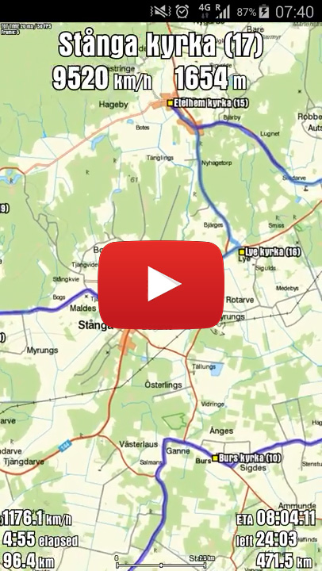
</a>

 

This is a personal project that I've used for hiking, bikepacking and motorcycling. The main features are:

- Fully offline (map tiles are downloaded and stored on the device in advance)
- Uses highly detailed geodata from Swedish Lantmäteriet, which has many features (most importantly trails) not available in products like Google Maps, Maps.me or OpenStreetMap
- Navigation along custom routes and waypoints
- Points of interest (e.g. shelters and water)
- Predicted arrival times at end and waypoints, based on past performance
- Raw GPS data stored for future analysis / export to KML
- Minimal battery usage

Technical features:

- Flawless pinch-zoom and pan in full 60 FPS (on a 2014 Samsung Galaxy S5)
- Tiles are cached in memory for more efficient rendering
- Multi-hierarchical quad tree implementation for efficiently drawing arbitrary resolution routes on tiles at any zoom level (see `QuadNode.java`)

I never published the app, since its main attraction was the highly detailed Swedish geodata,
whose license terms didn't allow publishing. Instead I've used
the app for my own recreation, including three major personal adventures/challenges, described in more detail below:
1. Biking from Norway to the Baltic Sea, exclusively on trails and dirt roads (_failed_)
2. Visiting all 92 medieval churches on the Swedish island of Gotland in one day
3. Biking the entire length of the hiking trail Sörmlandsleden in Sweden (627 km)

### Biking from Norway to the Baltic Sea

The idea was to bike from Norway, across Sweden, all the way to the Baltic Sea, exclusively
on trails and dirt roads. The rule was that the bike tires were not allowed to touch asphalt _at all_.
A program was developed to search all trails and roads of Sweden using a variant of Dijkstra's algorithm,
and the shortest solution ended up being a 339,480 meter route consisting of 177 km dirt roads, 101 km hiking trails,
42 km tractor roads, 12 km jogging trails, and 7 km park roads. I recruited another biker and the plan
was to cover the distance in 4 days.

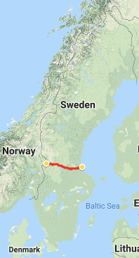
&nbsp;
<a href="https://maxbennedich.github.io/trailmap/demo/play-norway-baltic-route-finding.html">
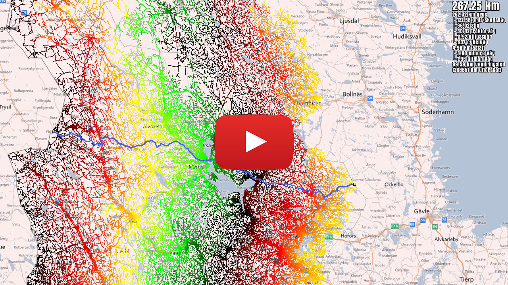
</a>
 
<i>Map data left: Google</i>

 

Unfortunately, the route started by traversing the mountainous area around the alpine ski resort Sälen,
which had very rough terrain, and after only 37 km we suffered mechanical issues with one of our bikes and had to abort.
At this time, I also used an older version of the mapping app which was not fully offline, and this turned
out to be a major problem both across the border in Norway and in the deep forests where there was no reception.

### The 92 churches of Gotland

The next use case was to visit the 92 medieval churches on the Swedish island of Gotland on a motorbike,
in a single day and at the shortest possible distance. I used the same program as for the previous bike trip to calculate the
shortest distance between each pair of churches, then used a solver for the traveling salesman problem
to find the shortest distance to visit all 92 churches (modifying the problem to not have to return to
the starting position). The final route was 567,919 meters; 416 km asphalt, 150 km dirt/trail, 1 km ferry,
and 1 km pushing the motorbike through a pedestrian area in the island's main town Visby.

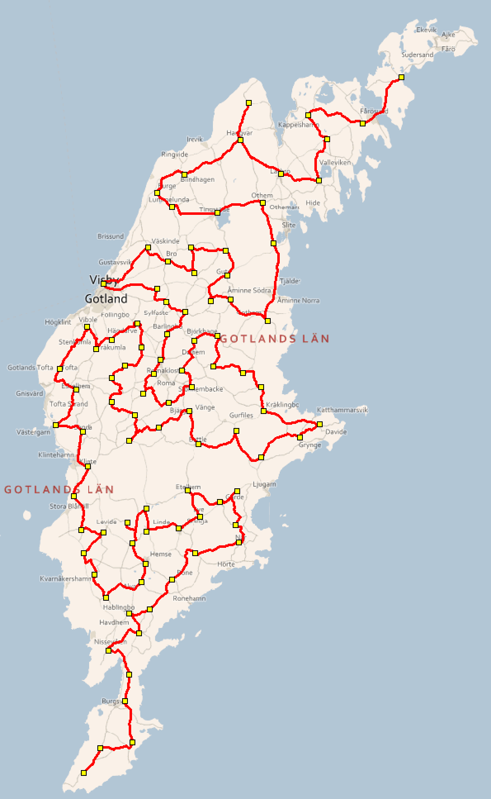
&nbsp;
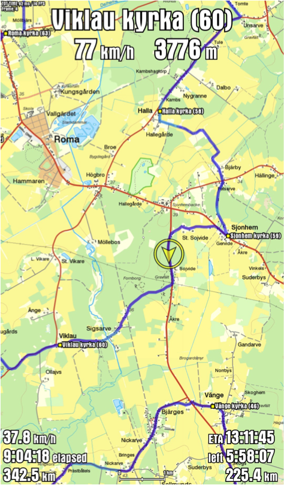
&nbsp;
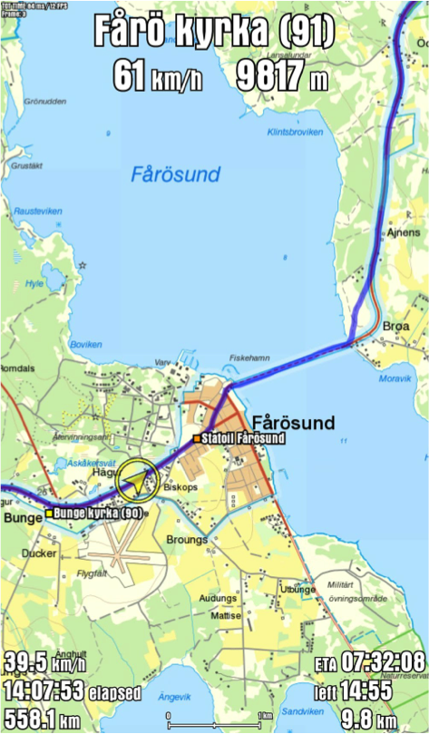

 

The mapping/navigation Android
app was crucial to make sure I never missed a turn (or a church), and also served as motivation during the journey by
displaying the progress and estimated time of arrival. I mounted the phone on the handlebars and connected
it to the motorcycle battery to stay charged all day. I started at midnight, and finished after 21 hours
and 42 minutes. The journey was featured in
[this news article](http://www.gotland.net/se-och-gora/arkiv/kortaste-vagen-mellan-ons-kyrkor)
(in Swedish).

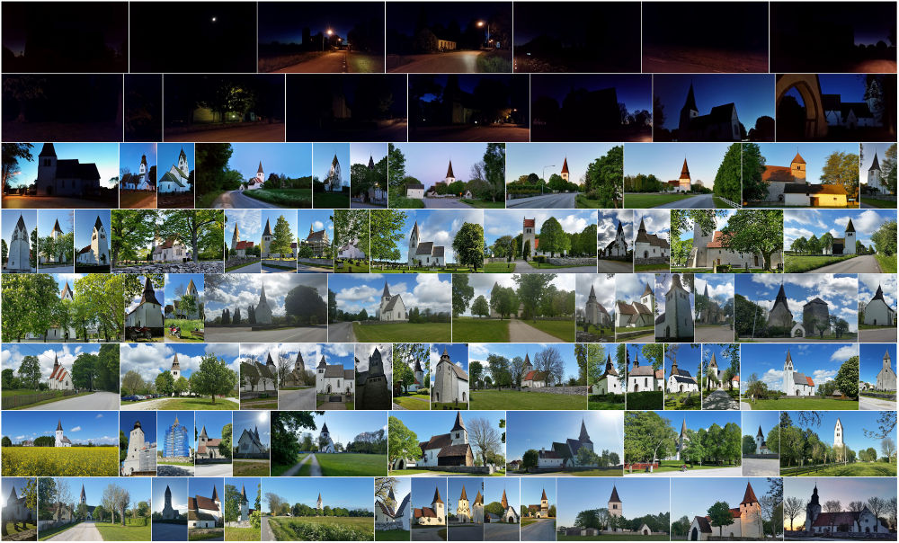

 

### Biking Sörmlandsleden

A final use case of the app was to bike the main route of the hiking trail Sörmlandsleden in Sweden,
which consists of 62 sections totaling 627 km.

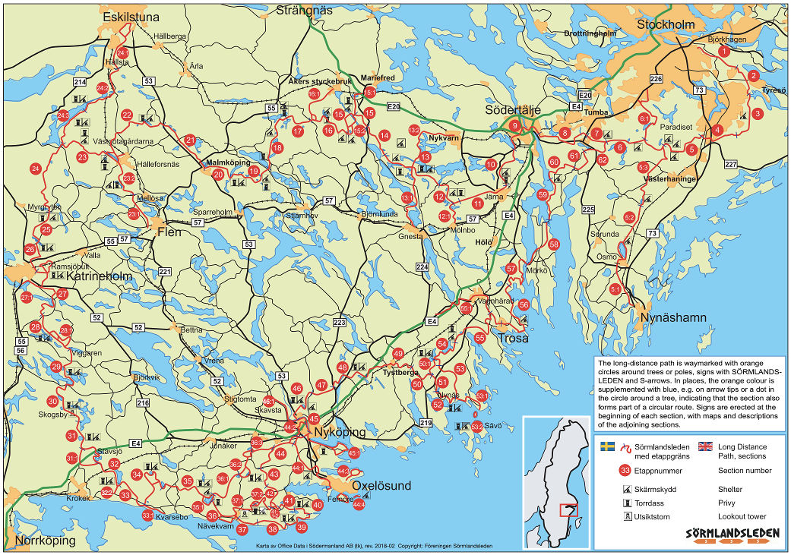

 

I put quite a bit of work into creating a digital version of the route. Part of it was
available from OpenStreetMap (OSM), but many sections were still missing (at least at the time this
project took place). The accuracy of the OSM data also varies, and some sections are
incorrect since the hiking trail is frequently re-routed. Instead I used the high quality data
from Lantmäteriet (Swedish mapping authority), which has a layer consisting of all hiking trails
in Sweden. Unfortunately, this data is not very structured. It consists of thousands of tiny
individual pieces of trail, in seemingly random order, and with no information on whether
a piece is part of Sörmlandsleden or any of the other dozens of trails around Stockholm.
An example is shown below, the raw data on the left (where each yellow square represents the start
or end of a piece of trail), and the actual stretch of the hiking trail on the right.

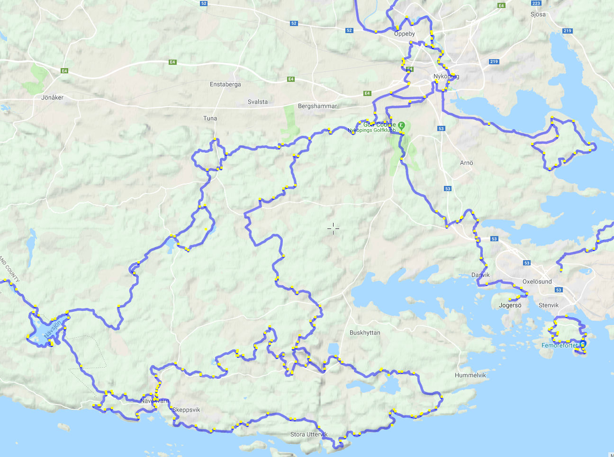
&nbsp;
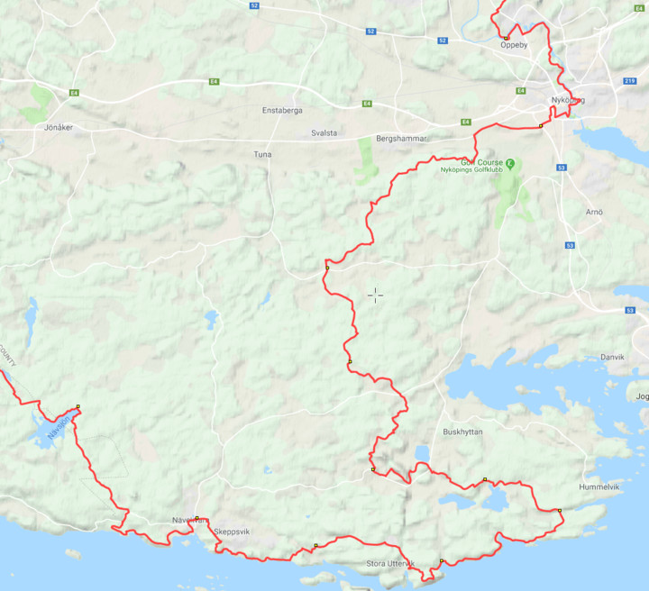
 
<i>Map data: Google</i>

 

To extract the hiking trail, I wrote a script that gathered information about the start and
end coordinates of all its 62 sections from the hiking trail's website, mapped that to the
raw geodata to find matching section endpoints, then looked for matching pieces of trail to
fill in the entire, sorted, route. The result is illustrated below, with each yellow square
representing the start/end of a section.

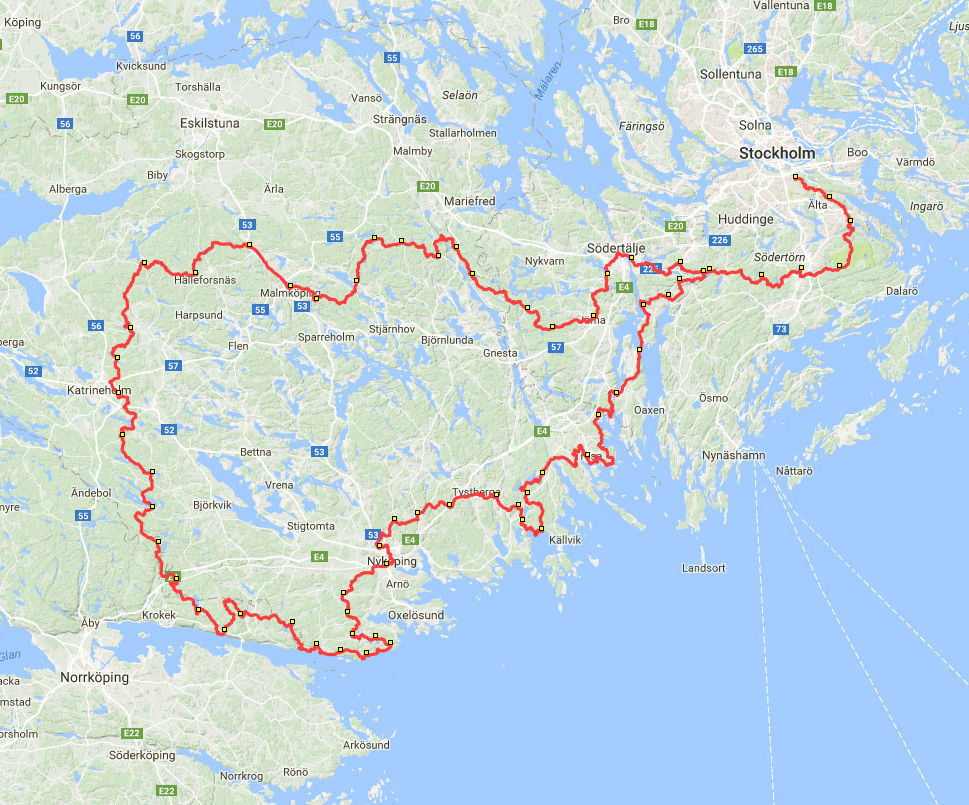
 
<i>Map data: Google</i>

 

Other data sources were used to add the location of all public shelters (wooden huts)
and water supplies near the route, and finally everything was loaded into the trail map app.
Below are examples of what the app looks like during use.

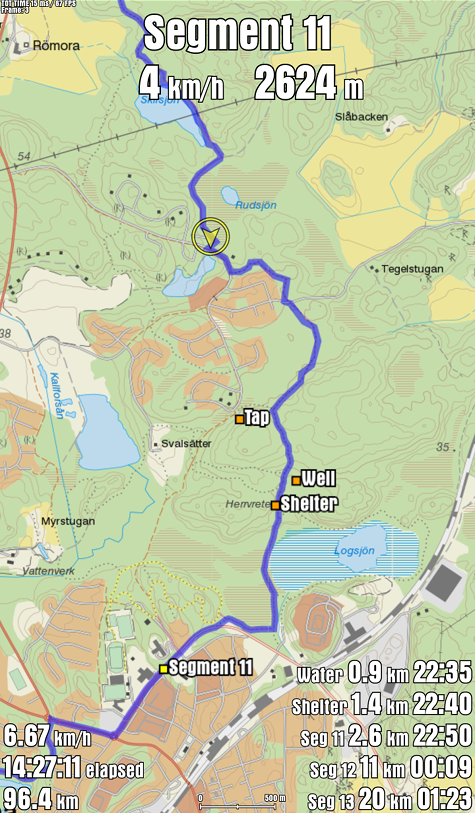
&nbsp;
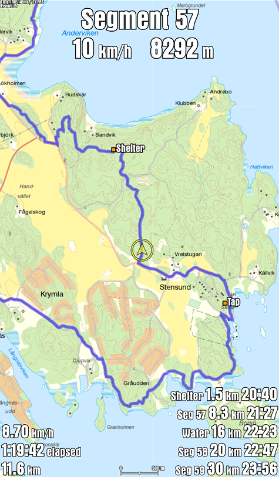

 

Apart from showing directions, the most useful aspect of the app was that it displayed
the distance and estimated time to the next shelter and water supply (based on how fast I'd biked
on previous sections) which made it easier to plan resources and where to spend the next night.

During this project, I also experimented with predicting the pace for a section, based
on altitude data and trail surface (e.g. paved / dirt / trail). Some sections of the trail
are rugged and stick to the forest, while others are flatter and consist of dirt
or even paved roads, allowing much higher speed on a bike.

To predict the pace for a section, I wrote a program that analyzes how technically challenging
a section is. First, data from Lantmäteriet and Trafikverket (Swedish Transport Administration)
was combined to determine the surface type along the section, grouped by trail, dirt road, or asphalt.
A relative speed was defined (based on empirical testing), where dirt road was defined as 2.4x
faster than trail, and asphalt road 3x faster than trail. Next, altitude data from Lantmäteriet was
used to more accurately estimate the speed. This was done using a formula based on
[Tobler's hiking function](https://en.wikipedia.org/wiki/Tobler%27s_hiking_function), adapted slightly
for biking instead of hiking. This formula basically states that hiking speed slows down at inclines and
steep declines. Combining this formula with the trail surface type, the speed can be estimated at every
single meter along the way, and consequently the average pace can be estimated for the entire section.

Lantmäteriet has very high precision in their altitude data, with a grid resolution of 2 meters
(i.e. one measurement every other meter, in a grid), measured by laser scanning from airplanes
flown at low altitude and at the optimal time of year. In tests I've done, this altitude data is much more reliable
than using GPS (at least a cell phone GPS). Other publically available altitude data is typically
measured from space, and has much lower resolution and accuracy.
[SRTM](https://en.wikipedia.org/wiki/Shuttle_Radar_Topography_Mission) and
[ASTER](https://en.wikipedia.org/wiki/Advanced_Spaceborne_Thermal_Emission_and_Reflection_Radiometer#ASTER_Global_Digital_Elevation_Model)
have a resolution of 30 - 90 meters, and Google Maps Elevation API only offers 150 - 600 meter
resolution in the Stockholm region. With such a low resolution, the data becomes very
unreliable for the type of pace analysis described above. Below is an example of what the altitude
profile looks like for section 39 of Sörmlandsleden, using Lantmäteriet's data, Google Maps Elevation API,
and data from OpenStreetMaps.

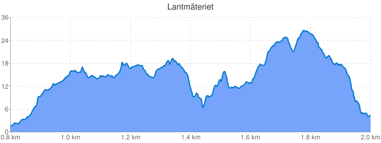

 

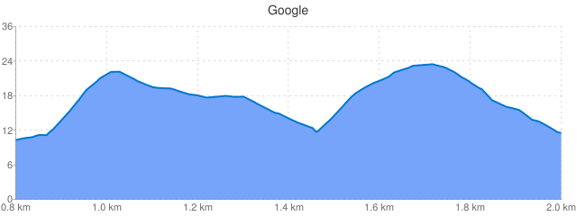

 

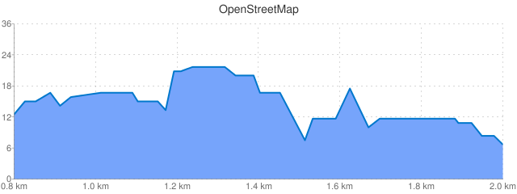

 

Of course, it's more complicated than this in reality. Rocks, roots, and other obstacles
can make a trail a lot more difficult than another, even though they have the same profile.
But this method worked well as a rough estimate. The
same method can be used for hiking and running by adjusting the relative speeds (hiking is
not 3x faster on asphalt than on trail). With more recorded data available, it'd be interesting
to apply regression analysis or machine learning to improve this method.