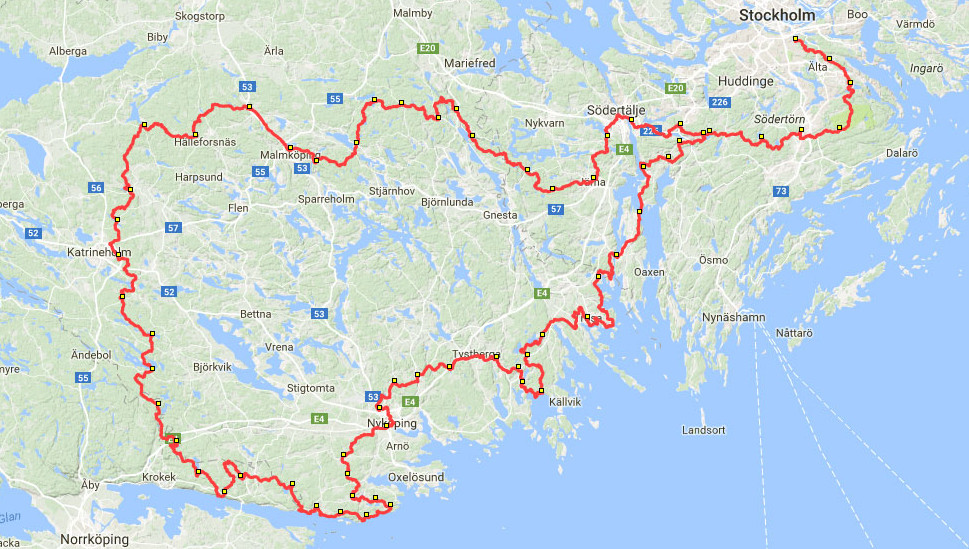

# Trailmap

Offline tile-based mapping and navigation for Android.

<video height="500" controls>
<source src="demo/navigation-demo.mp4" type="video/mp4">
</video>

 

This is a personal project that I've used for hiking, bikepacking and motorcycling. The main features are:

- Fully offline (map tiles are downloaded and stored on the device in advance)
- Uses highly detailed geodata from Swedish Lantmäteriet, which has many features (most importantly trails) not available in products like Google Maps, Maps.me or OpenStreetMap
- Navigation along custom routes and waypoints
- Points of interest (e.g. shelters and water)
- Predicted arrival times at end and waypoints, based on past performance
- Raw GPS data stored for future analysis / export to KML
- Minimal battery usage

Technical features:

- Flawless pinch-zoom and pan in full 60 FPS (on a 2014 Samsung Galaxy S5)
- Tiles are cached in memory for more efficient rendering
- Multi-hierarchical quad tree implementation for efficiently drawing arbitrary resolution routes on tiles at any zoom level (see `QuadNode.java`)

I never published the app, since its main attraction was the highly detailed Swedish geodata,
whose license terms didn't allow publishing. Instead I've used
the app for my own recreation, including three major personal adventures/challenges, described in more detail below:
1. Biking from Norway to the Baltic Sea, exclusively on trails and dirt roads (_failed_)
2. Visiting all 92 medieval churches on the Swedish island of Gotland in one day
3. Biking the entire length of the hiking trail Sörmlandsleden in Sweden (627 km)

### Biking from Norway to the Baltic Sea

The idea was to bike from Norway, across Sweden, all the way to the Baltic Sea, exclusively
on trails and dirt roads. The rule was that the bike tires were not allowed to touch asphalt _at all_.
A program was developed to search all trails and roads of Sweden using a variant of Dijkstra's algorithm,
and the shortest solution ended up being a 339,480 meter route consisting of 177 km dirt roads, 101 km hiking trails,
42 km tractor roads, 12 km jogging trails, and 7 km park roads. I recruited another biker and the plan
was to cover the distance in 4 days.

&nbsp;
<video height="320" controls>
<source src="demo/norway-baltic-route-finding.mp4" type="video/mp4">
</video>

 

Unfortunately, the route started by traversing the mountainous area around the alpine ski resort Sälen,
which had very rough terrain, and after only 37 km we suffered mechanical issues with one of our bikes and had to abort.
At this time, I also used an older version of the mapping app which was not fully offline, and this turned
out to be a major problem both across the border in Norway and in the deep forests where there was no reception.

### The 92 churches of Gotland

The next use case was to visit the 92 medieval churches on the Swedish island of Gotland on a motorbike,
in a single day and at the shortest possible distance. I used the same program as for the previous bike trip to calculate the
shortest distance between each pair of churches, then used a solver for the traveling salesman problem
to find the shortest distance to visit all 92 churches (modifying the problem to not have to return to
the starting position). The final route was 567,919 meters; 416 km asphalt, 150 km dirt/trail, 1 km ferry,
and 1 km pushing the motorbike through a pedestrian area in the island's main town Visby.

&nbsp;

&nbsp;

 

The mapping/navigation Android
app was crucial to make sure I never missed a turn (or a church), and also served as motivation during the journey by
displaying the progress and estimated time of arrival. I mounted the phone on the handlebars and connected
it to the motorcycle battery to stay charged all day. I started at midnight, and finished after 21 hours
and 42 minutes. The journey was featured in
[this news article](http://www.gotland.net/se-och-gora/arkiv/kortaste-vagen-mellan-ons-kyrkor)
(in Swedish).

 

### Biking Sörmlandsleden

A final use case of the app was to bike the 627 km hiking trail Sörmlandsleden in Sweden.
I used several sources of data to map the route as well as all public shelters (wooden huts)
and water supplies near the route. Apart from showing directions, the most useful aspect
of the app was that it displayed the remaining time to the
next shelter and water supply (based on how fast I'd biked on previous segments) which made it
easy to plan resources and where to spend the next night.

&nbsp;

 
